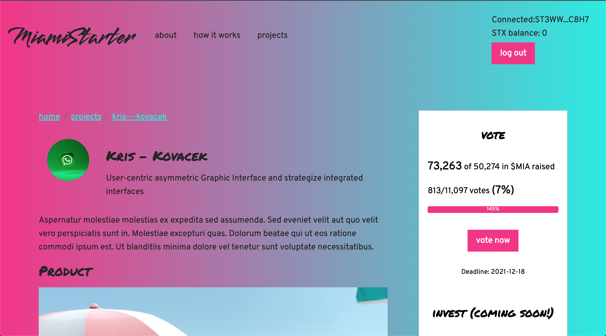
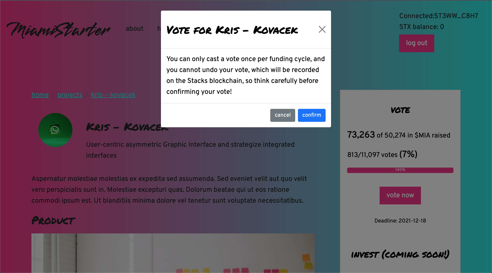
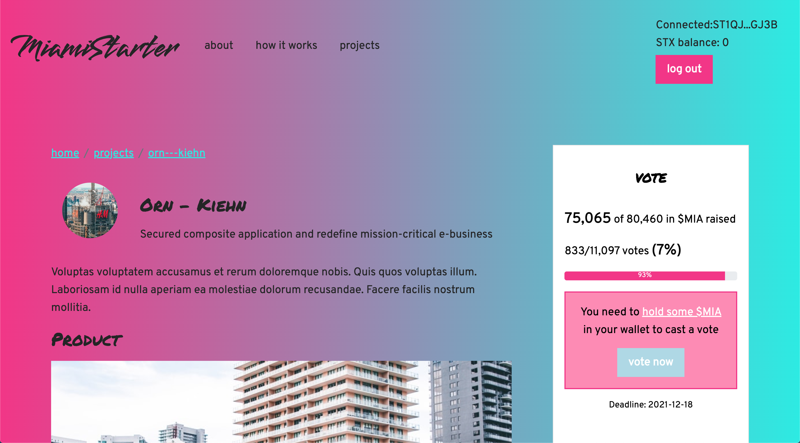

# MiamiStarter

Miamistarter is a Web 3.0 app that allows $MIA token holders to vote on and/or invest in innovative crypto and tech startups based in Miami. Users can log into the app using a Stacks wallet such as [Hiro](https://www.hiro.so/wallet).

## Deployed Site URL

The project has been deployed to [Heroku: MiamiStarter](https://miamistarter.herokuapp.com).

## Presentation URL

[YouTube: MiamiStarter Presentation]()

## Problem

Talent and capital have often been cited as barriers to Miami's growth as the next tech hub. To become the next tech hub, Miami needs to attract and retain more tech talent in the city. 

Startups and tech workers are attracted to investment potential and innovation networks.

MiamiCoin’s contributions to the city's treasury have grown to tens of millions of dollars, and Mayor Suarez and the City of Miami Commission have proposed several uses for the funds, including creating economic incentives for tech entrepreneurs.

Using MiamiStarter, $MIA token holders can directly invest in and vote on startups and businesses that they think the city should support.

## Enter MiamiStarter

Miamistarter is a Web 3.0 app that allows $MIA token holders to vote on and/or invest in innovative crypto and tech startups based in Miami.

MiamiStarter helps the city put the funds it receives via $MIA mining to attract crypto founders and other tech entrepreneurs to Miami, thereby growing Miami's tech ecosystem. 

Moreover, by requiring $MIA tokens to participate in the voting process, MiamiStarter creates an incentive for people to hold $MIA, thereby contributing to $MIA adoption in the city.

## How MiamiStarter Works

Each funding cycle lasts for 30 days. Prior to the start of each cycle, the City of Miami's commission vets projects from Miami-based businesses and features them on MiamiStarter. The city also releases a set amount of funding, in the form of $MIA tokens, into a smart  contract.

During each cycle, $MIA token holders can review and vote on project proposals featured on MiamiStarter. To do so, users must possess a Stacks wallet (i.e., Hiro) that holds a minimum balance of $MIA tokens. Each user can only cast one vote in each funding cycle.

Besides voting, users can directly invest in projects using $MIA tokens. If they meet certain investment thresholds, then they could be eligible to mint limited edition NFTs that give them access to special perks.

At the end of each cycle, each project would receive an amount of $MIA token that is proportional to the number of votes on their projects. Suppose a project received 200 votes out of a possible 1000 total votes in a given cycle; in this case the startup is eligible to receive 20% of the funding pool. The $MIA tokens can either be cashed out to US dollars to fund immediate needs or stacked to earn a yield and cashed out later on. A smart contract, built on top of Stacks protocol, automates the deposit, transfer, and withdrawal of funds.

## How to Use MiamiStarter

1. Install the [Hiro Wallet](https://www.hiro.so/wallet) in your browser. The Stacks wallet allows you to connect to MiamiStarter using your digital assets and identity on the Stacks blockchain.

2. Acquire MiamiCoin ($MIA) either by buying the token from okcoin.com or [by mining](https://minemiamicoin.com/).
   
3. On the MiamiStarter app, press the `connect to web3` button to log into MiamiStarter with your wallet.
   
4. Select a project that you'd like to vote on or invest in directly by clicking on the project card. You'll then be taken to the individual project page. If you are logged in and your wallet contains some $MIA tokens, then you will see a card containing voting details and a "vote now" button on the right side of the project page, as follows:

If you press the `vote now` button, a confirmation modal would appear on the screen, as follows:

Press confirm to cast a vote, or cancel to close the modal.

However, if your wallet does not contain any $MIA token, then the `vote now` button would be disabled on the project page, as follows:

Whenever you're done, you can press the `log out` button to disconnect your wallet and log out of the app.
## Directory Structure

- `/.github/workflows`: contains the configuration files for building and deploying the app automatically
- `/images`: contains images for the readme
- `/public`: contains the `index.html` file where the compiled scripts will be attached during the build process
- `/src`
  - `/api`
    - `client.js`: a client wrapper around the Fetch API that supports `GET`, `POST`, `PUT`, and `DELETE` requests
  - `/app`: contains the top-level component for the application
    - `/layout`
      - `/footer`: contains the `Footer` component and css file
      - `/header`: contains the `Header` component and css file
      - `/navigation`: contains the `Navigation` component and css file
      - `/route-with-error-boundary`: contains the `RouteWithErrorBoundary` component, which wraps other components with an error boundary
      - `index.js`: defines and exports the `Layout` component, which contains the routing for the application
    - `index.js`: exports the `App` component, which can render different layouts
    - `store.js`: configures and exports the Redux store
  - `/common`: contains code used across components annd throughout the application
    - `/constants`: contains shared constants (e.g., `STATUS.idle`)
    - `/core`: contains generic components (e.g., `Button`, `Modal`, `Loader`, etc.)
    - `/utils`: contains utility functions (e.g., `formatNumber()`)
  - `/features`: contains the code for the main features of the application
    - `/auth`: contains all files related to the `auth` feature
    - `/projects`: contains all files related to the `projects` feature, which includes the `ProjectCard`, `ProjectsList` and `ProjectView` components.
    - `index.js`: exports the components from the `/features` folder
  - `/styles`
    - `global.css`: contains global css styles used throughout the application
  - `/pages`: contains components that each represents a page of the application
  - `index.js`: entry point to the React Application
  - `setupTests.js`: import any additional libraries used to extend test functionality (e.g, `jest-dom`)
- `createFakeData.js`: a script that is run in Node.js to populate `db.json` with fake projects data for the frontend
- `server.js`: server middleware configuration
- `db.json`: JSON database for the REST API
- `routes.json`: routing logic for the REST API

The following principles were applied in the design of the folder structure:

- A consistent and predictable naming convention makes it relatively easy to locate needed files and understand where new files should be created. Each feature contains sub-folders that represent a CRUD operation for that feature (e.g., `/create`, `/edit`).

- All files related to a component (e.g., component, test, and css files) are kept together under a single folder so it's easy to find and update the code for a given feature.

- The service abstracts away the API logic for each feature, thereby avoiding the need to hard-code the API calls into the components directly.

- Core UI components such as Button, Form, List, etc. are kept in a separate directory (i.e., `src/common/core`). As the UI library continues to grow, the core UI library could be packaged for use in another project or published as part of Storybook. Some developers on the team can even focus on this directory only.

## User Stories

1. As a user, I want to view a list of projects, so that I can view the most important information about each project.
2. As a user, I want to connect my Stacks wallet to the website, so that I can vote on projects.
3. As a user, I want to view a specific project, so that I can get more specific information about the project and vote on/invest in the project.
   1. I can only vote on projects if I have a non-zero amount of $MIA in my wallet
   2. I can only vote once per funding cycle, on a single project

## Next Steps

- Create a New Project intake form so that entrepreneurs can submit their projects to be considered for funding on MiamiStarter
- Testing apps that rely on $MIA to work is currently difficult since $MIA is not available via any testnet faucets (not that I know of), so perhaps it would be helpful to create such a faucet on testnet so the future developers can more easily test their applications
- Allow the user to send $MIA directly to the wallet associated with each project as a direct investment
- Create a (Stacks) smart contract that allows project supporters to mint NFTs as perks in the Stacks network. The NFTs would in turn grant them special privileges to a project, such as gaining early access to products or special discounts.
- Create a (Stacks) smart contract to keep track of the number of votes and amount of funding received for each project

## Installation

This project was bootstrapped with [Create React App](https://github.com/facebook/create-react-app).

Note that you'd need to install the [Hiro wallet](https://www.hiro.so/wallet) as a browser extension.

### Running the project locally

First, fork and then clone the project locally.

In the project root, you can run `yarn install` to install the frontend and smart contract dependencies.

Then run `yarn start` which concurrently runs the app in the development mode, and starts a REST API at `http://localhost:3004` (for serving the mock projects data).

Open [http://localhost:3000](http://localhost:3000) to view the app in the browser.

The page will reload if you make edits.\
You will also see any lint errors in the console.

## Other Scripts

In the project directory, you can run:

### `yarn test`

Launches the test runner in the interactive watch mode.\
See the section about [running tests](https://facebook.github.io/create-react-app/docs/running-tests) for more information.

### `yarn build`

Builds the app for production to the `build` folder.\
It correctly bundles React in production mode and optimizes the build for the best performance.

The build is minified and the filenames include the hashes.\
Your app is ready to be deployed!

See the section about [deployment](https://facebook.github.io/create-react-app/docs/deployment) for more information.

### `yarn eject`

**Note: this is a one-way operation. Once you `eject`, you can’t go back!**

If you aren’t satisfied with the build tool and configuration choices, you can `eject` at any time. This command will remove the single build dependency from your project.

Instead, it will copy all the configuration files and the transitive dependencies (webpack, Babel, ESLint, etc) right into your project so you have full control over them. All of the commands except `eject` will still work, but they will point to the copied scripts so you can tweak them. At this point you’re on your own.

You don’t have to ever use `eject`. The curated feature set is suitable for small and middle deployments, and you shouldn’t feel obligated to use this feature. However we understand that this tool wouldn’t be useful if you couldn’t customize it when you are ready for it.

## Learn More

You can learn more in the [Create React App documentation](https://facebook.github.io/create-react-app/docs/getting-started).

To learn React, check out the [React documentation](https://reactjs.org/).

### Code Splitting

This section has moved here: [https://facebook.github.io/create-react-app/docs/code-splitting](https://facebook.github.io/create-react-app/docs/code-splitting)

### Analyzing the Bundle Size

This section has moved here: [https://facebook.github.io/create-react-app/docs/analyzing-the-bundle-size](https://facebook.github.io/create-react-app/docs/analyzing-the-bundle-size)

### Making a Progressive Web App

This section has moved here: [https://facebook.github.io/create-react-app/docs/making-a-progressive-web-app](https://facebook.github.io/create-react-app/docs/making-a-progressive-web-app)

### Advanced Configuration

This section has moved here: [https://facebook.github.io/create-react-app/docs/advanced-configuration](https://facebook.github.io/create-react-app/docs/advanced-configuration)

### Deployment

This section has moved here: [https://facebook.github.io/create-react-app/docs/deployment](https://facebook.github.io/create-react-app/docs/deployment)

### `yarn build` fails to minify

This section has moved here: [https://facebook.github.io/create-react-app/docs/troubleshooting#npm-run-build-fails-to-minify](https://facebook.github.io/create-react-app/docs/troubleshooting#npm-run-build-fails-to-minify)
